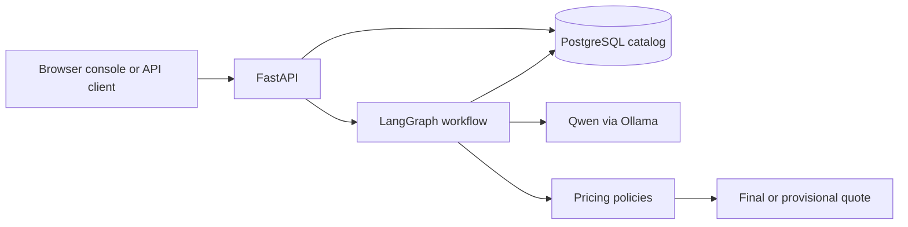
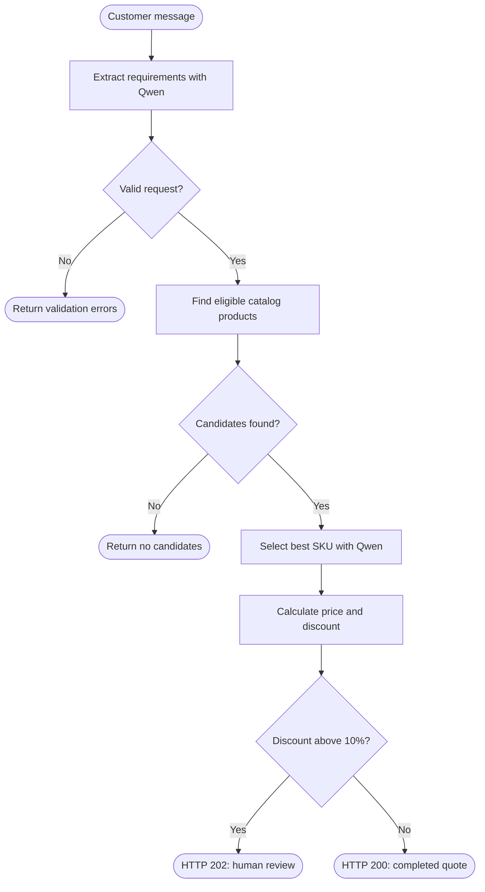

# QuoteBench

QuoteBench is a locally hosted, AI-powered semiconductor quoting system that
  matches customer needs with catalog products and generates deterministic quotes,
  flagging exceptions for human approval. It uses FastAPI, LangGraph, Qwen via
  Ollama, PostgreSQL, and includes a minimalist browser console—all without
  requiring an external AI API key.

https://github.com/user-attachments/assets/84207700-d9d0-4cd5-a0e4-f4cbdb1d037f


## System overview



- **FastAPI** exposes the UI, catalog endpoints, health check, and quote API.
- **LangGraph** coordinates requirement extraction, retrieval, product
  selection, pricing, and approval routing using a typed shared state.
- **Qwen** extracts structured requirements and chooses from catalog candidates.
- **PostgreSQL** stores product data and ranks candidates using full-text search,
  quantity constraints, and delivery constraints.
- **Pricing policies** calculate volume discounts and require manager review
  when the applied discount exceeds 10%.

## Quote graph



Each node adds fields to a `FinalState` object. The deterministic validation,
catalog constraints, pricing, and approval policy remain outside the model so
the LLM cannot invent a product or override business rules.

## API

| Method | Path | Purpose |
| --- | --- | --- |
| `GET` | `/` | Open the browser test console |
| `GET` | `/health` | Check API health |
| `GET` | `/products` | List catalog products |
| `POST` | `/products` | Add a catalog product |
| `POST` | `/quote` | Generate a quote from a customer message |

Interactive API documentation is available at `/docs` while the server is
running.

## Run locally

Requirements: Docker, [uv](https://docs.astral.sh/uv/), and
[Ollama](https://ollama.com/).

```bash
cp .env.example .env
docker compose up -d
ollama pull qwen3:4b
uv sync
uv run fastapi dev app/main.py
```

Ensure Ollama is running, then open <http://127.0.0.1:8000>.

Run the automated tests with:

```bash
uv run pytest
```

See [the architecture documentation](docs/architecture.md) for additional
implementation details.


See [the architecture documentation](docs/architecture.md) for workflow,
component, comparison, storage, and testing details.
