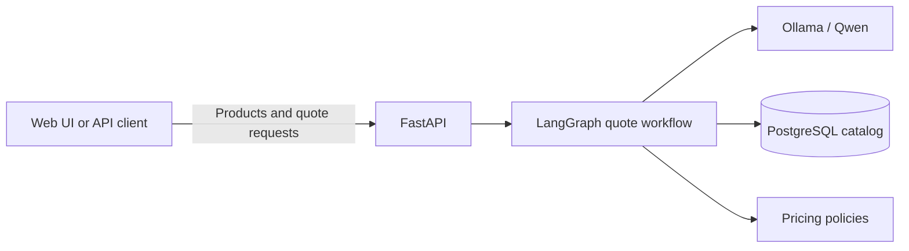
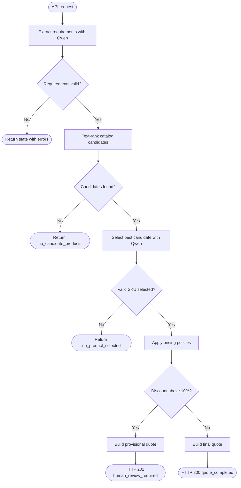

# QuoteBench architecture

## Overview

QuoteBench turns a natural-language semiconductor request into either a final
quote or a provisional quote requiring manager approval. The workflow runs
locally with Qwen through Ollama and does not require an external AI API key.

## System components



## Quote workflow



## API surface

| Method | Path | Purpose | Successful result |
| --- | --- | --- | --- |
| `GET` | `/` | Open the developer console | HTML page |
| `GET` | `/health` | Service health check | Health message |
| `GET` | `/products` | List catalog products | Product array |
| `POST` | `/products` | Insert a product | `201` and product |
| `POST` | `/quote` | Run the local Qwen workflow | `200` final or `202` review |

## Storage and retrieval

The `products` table stores ordinary catalog fields in PostgreSQL. Candidate
retrieval uses PostgreSQL full-text ranking across the product name and
supported application, then filters out products whose minimum order quantity
or lead time cannot satisfy the request. SKU is the primary key, so duplicate
product insertion returns HTTP `409`.

## Configuration

| Variable | Default | Purpose |
| --- | --- | --- |
| `QWEN_CHAT_MODEL` | `qwen3:4b` | Local Ollama model name |
| `OLLAMA_BASE_URL` | `http://localhost:11434` | Ollama server |
| `DATABASE_URL` | local Docker URL | PostgreSQL connection |

Before quoting, start Ollama and pull the configured model:

```bash
ollama pull qwen3:4b
ollama serve
```

## Testing strategy

Tests exercise the compiled LangGraph with the local model and database
boundaries replaced by deterministic fakes. This verifies conditional routing,
pricing thresholds, catalog responses, and FastAPI error behavior without
network calls.
