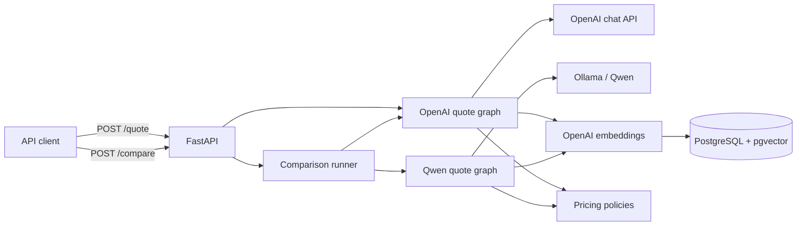
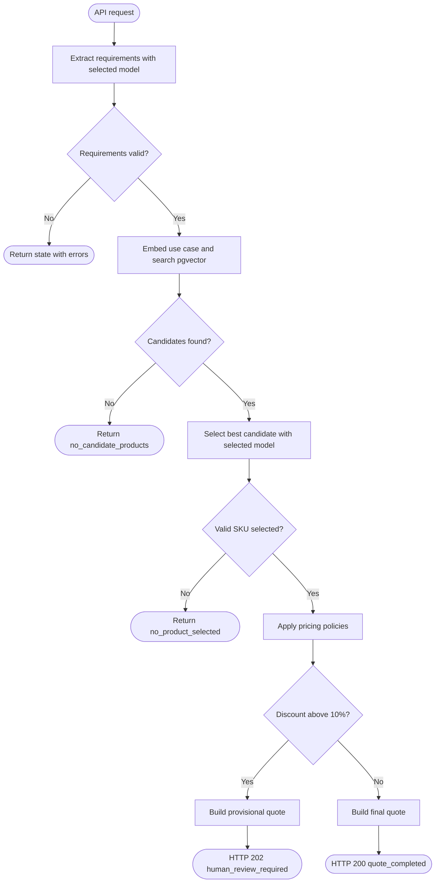
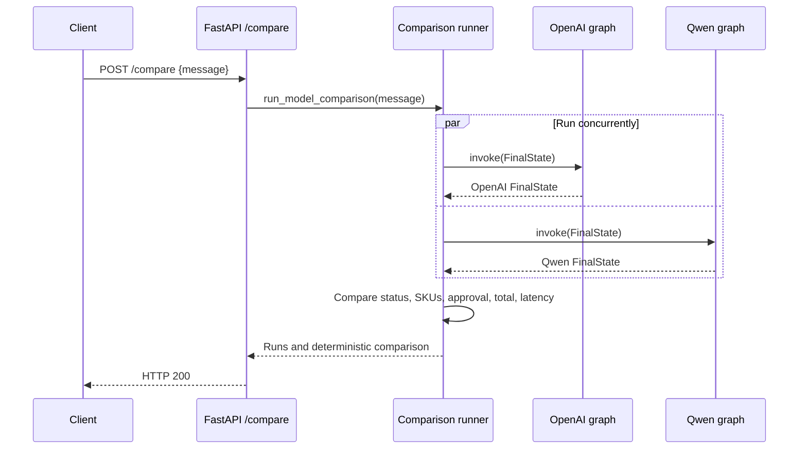

# QuoteBench architecture

## Overview

QuoteBench turns a natural-language semiconductor request into either a final
quote or a provisional quote requiring manager approval. The same LangGraph
workflow can use OpenAI or a locally hosted Qwen model through Ollama. Product
retrieval and pricing remain identical between providers so `/compare` measures
model behavior rather than pipeline differences.

## System components



The two comparison runs intentionally share the OpenAI embedding model. Only
the chat model used for requirement extraction and product selection changes.
This isolates the behavior being compared.

## Quote workflow



Every node adds data to one `FinalState`. Fields that have not yet been
produced remain `null`. Nodes return only their updates, while LangGraph merges
those updates into the state.

## Model comparison



Each model failure is captured in its own run. The endpoint returns
`partial_failure` when one provider fails and `failed` when neither completes.
Comparison metrics are available only when both workflows succeed.

## API surface

| Method | Path | Purpose | Successful result |
| --- | --- | --- | --- |
| `GET` | `/health` | Service health check | Health message |
| `POST` | `/products` | Embed and insert a product | `201` and product |
| `POST` | `/quote` | Run the OpenAI quote workflow | `200` final or `202` review |
| `POST` | `/compare` | Run OpenAI and Qwen workflows | Both runs and comparison |

## Comparison response

```json
{
  "status": "completed",
  "openai": {
    "provider": "openai",
    "model": "gpt-4o",
    "latency_ms": 842.31,
    "result": {"status": "quote_completed"},
    "error": null
  },
  "qwen": {
    "provider": "qwen",
    "model": "qwen3:4b",
    "latency_ms": 1201.44,
    "result": {"status": "quote_completed"},
    "error": null
  },
  "comparison": {
    "available": true,
    "same_status": true,
    "same_selected_skus": true,
    "same_human_review_decision": true,
    "same_total": true,
    "total_difference_usd": 0,
    "faster_provider": "openai",
    "latency_difference_ms": 359.13
  }
}
```

## Storage

The `products` table stores catalog fields and a configurable-dimension
`vector` column. Candidate retrieval uses cosine distance and filters out
products whose minimum order quantity or lead time cannot satisfy the request.
SKU is the primary key, so duplicate product insertion returns HTTP `409`.

## Pricing and human review

Pricing is deterministic and shared by both graphs:

- Quantities below 100 receive no automatic discount.
- Quantities from 100 through 499 receive 5%.
- Quantities of 500 or more receive 10%.
- The higher of the volume discount and requested discount is applied.
- Applied discounts above 10% produce a provisional quote for manager review.

## Configuration

| Variable | Default | Purpose |
| --- | --- | --- |
| `OPENAI_API_KEY` | none | OpenAI chat and embedding authentication |
| `OPENAI_CHAT_MODEL` | `gpt-4o` | OpenAI comparison model |
| `QWEN_CHAT_MODEL` | `qwen3:4b` | Ollama model name |
| `OLLAMA_BASE_URL` | `http://localhost:11434` | Ollama server |
| `OPENAI_EMBEDDING_MODEL` | `text-embedding-3-small` | Retrieval embeddings |
| `OPENAI_EMBEDDING_DIMENSIONS` | `1536` | pgvector column size |
| `DATABASE_URL` | local Docker URL | PostgreSQL connection |

Before using Qwen, start Ollama and pull the configured model:

```bash
ollama pull qwen3:4b
```

## Testing strategy

Tests exercise the compiled LangGraph with the external LLM and database
boundaries replaced by deterministic fakes. This verifies provider selection,
conditional routing, pricing thresholds, comparison metrics, provider failure
isolation, and FastAPI response behavior without network calls.
